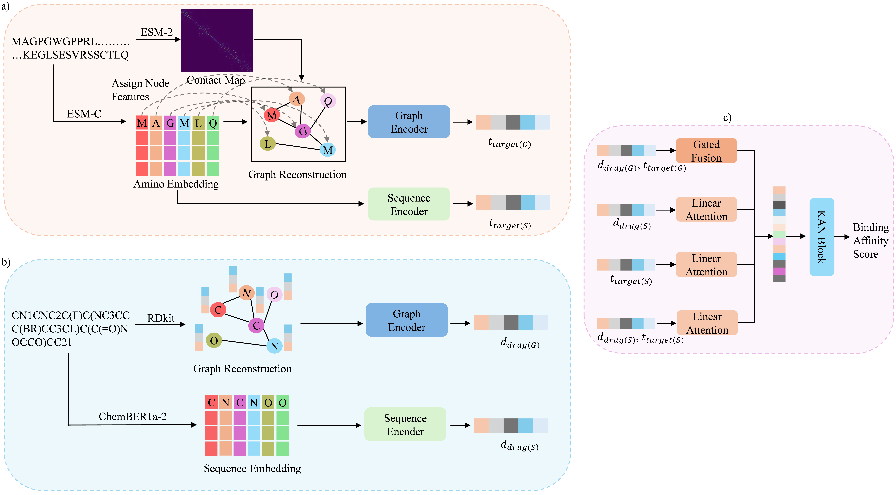

# KANPM-DTA: Improving Drug-Target Affinity Prediction with Kolmogorov-Arnold Networks and Pre-trained Models

<p align="center">
  
</p>
<p align="center"><em>Figure 1. KANPM-DTA model architecture.</em></p>

**Authors:** MD Youshuf Khan Rakib, Muhammad Habibulla Alamin, Jiamu Li, Sheikh Sohan Mamun, Kaleb Amsalu Gobena, Shengbing Ren

**Affiliation:** School of Computer Science and Engineering, Central South University, Changsha 410083, Hunan, China

**Corresponding Author:** rsb@csu.edu.cn

---

## What is This Paper About?

Drug-Target Affinity (DTA) prediction means figuring out how strongly a drug molecule binds to a specific protein target. This is a critical step in drug discovery — the stronger the binding, the more likely the drug will work.

**Problems with existing models:**
- They struggle to generalize to unseen (new) drug-target pairs
- They lack interpretability — you cannot understand why they make a prediction
- They fail to combine different types of biological information effectively

**What KANPM-DTA does differently:**
- Uses ESM protein language models to build richer protein representations
- Uses a Gated Fusion mechanism to combine drug and protein graph features
- Uses Linear Attention to capture relationships across different data types
- Uses a KAN (Kolmogorov-Arnold Network) as the final prediction head instead of a standard MLP

---

## Performance Results (Warm Setting)

Compared to previous best models, KANPM-DTA achieved:

| Dataset   | MSE Reduction | CI Increase | r2m Gain |
|-----------|--------------|-------------|----------|
| Davis     | 6.42%        | 0.45%       | 1.85%    |
| KIBA      | 4.86%        | 0.34%       | 0.90%    |
| Metz      | 4.44%        | 0.48%       | 0.84%    |
| BindingDB | 5.46%        | 0.80%       | 1.05%    |

Lower MSE = better. Higher CI and r2m = better.

### BindingDB Full Comparison Table

| Model                  | MSE       | CI        | r2m       |
|------------------------|-----------|-----------|-----------|
| DeepDTA (2018)         | 0.633     | 0.844     | 0.633     |
| AttentionDTA (2022)    | 0.745     | 0.542     | -         |
| GraphDTA-GIN (2021)    | 0.535     | 0.858     | -         |
| CoVAE (2021)           | 0.512     | 0.847     | 0.412     |
| DeepCDA (2020)         | 0.848     | 0.722     | 0.531     |
| ELECTRA-DTA (2022)     | 0.650     | 0.837     | 0.670     |
| DoubleSG-DTA (2023)    | 0.533     | 0.862     | 0.726     |
| GDilatedDTA (2024)     | 0.483     | 0.868     | 0.730     |
| MF-DTA (2025)          | 0.569     | 0.865     | 0.737     |
| DeepDTAGen (2025)      | 0.458     | 0.876     | 0.760     |
| **KANPM-DTA (Ours)**   | **0.433** | **0.883** | **0.768** |

---

## Model Architecture Overview

```
Drug SMILES  ──► ChemBERTa-2 ──► Drug Sequence Embedding
Drug SMILES  ──► Graph Builder ──► Drug Graph (GNN)
                                         │
Protein Sequence ──► ESM-C ──────────► ESM-C Node Features
Protein Sequence ──► ESM-2 ──► Contact Map ──► Protein Graph (GNN)
                                         │
                              Gated Fusion Mechanism
                                         │
                              Linear Attention Layer
                                         │
                              512-dim Feature Vector Z
                                         │
                              KAN Prediction Head
                                         │
                              Predicted Affinity Score (y_hat)
```

---

## Pretrained Models Used

Three external pretrained models are used to extract biological knowledge before the main model trains:

### 1. ChemBERTa-2 (for Drugs)
- Model ID: `DeepChem/ChemBERTa-77M-MTR`
- Based on RoBERTa architecture, trained on chemical data
- Input: SMILES string (a text representation of a drug molecule)
- Output: A vector embedding capturing the drug's chemical properties

### 2. ESM-2 (for Protein Contact Maps)
- Model ID: `esm2_t36_3B_UR50D`
- A large protein language model with 3 billion parameters
- Used specifically for its built-in contact prediction head
- Output: A probability map showing which amino acid residues are spatially close to each other in the folded protein

### 3. ESM-C (for Protein Sequences)
- Model ID: `esmc_600m`
- A 600 million parameter protein language model (ESM Cambrian)
- Input: Raw protein amino acid sequence
- Output: Per-residue embeddings that capture evolutionary and structural information

---

## KAN Block — Architecture and Details

The KAN block is the final prediction head. It takes the 512-dimensional fused feature vector Z and maps it to a single affinity score.

### Layer Dimensions

```
Input:    [Batch, 512]
Layer 1:  512  → 1024
Layer 2:  1024 → 512
Layer 3:  512  → 1
Output:   [Batch, 1]  (the predicted affinity score)
```

### How Each KAN Connection Works

In a standard MLP, each connection is just: `output = weight * input`

In KAN, each connection computes a learned function:

```
f(x) = w_base * SiLU(x)  +  sum of (c_k * B_k(x))
         └── residual path      └── B-spline curve path
```

- `SiLU(x)` = x * sigmoid(x) — the base activation
- `B_k(x)` = B-spline basis functions (smooth piecewise curves)
- `c_k` = learned coefficients for each basis function
- `w_base` = learned scalar weight for the residual path

The output of the whole layer is the sum of f(x) across all inputs for each output neuron. Each connection has its own completely separate learned function.

### Full Hyperparameter Settings

| Hyperparameter                     | Value               |
|------------------------------------|---------------------|
| Layer Dimensions                   | [512, 1024, 512, 1] |
| Spline Order                       | 3 (cubic)           |
| Grid Size                          | 5                   |
| Base Activation                    | SiLU                |
| Initialization Scale (Base)        | 1.0                 |
| Initialization Scale (Spline)      | 1.0                 |
| Initialization Scale (Noise)       | 0.1                 |
| Grid Initial Range                 | [-1, 1]             |
| Adaptive Grid Weight               | 0.02                |
| L1 Regularization Weight           | 1.0                 |
| Entropy Regularization Weight      | 1.0                 |

### KAN Initialization

- **Base weights** and **spline scalers**: Kaiming Uniform distribution (same as standard PyTorch linear layers)
- **Spline coefficients**: initialized by fitting B-spline basis functions to a small random noise curve — ensures each edge starts with a slightly different function (breaks symmetry) and keeps training stable

### KAN Regularization Loss

A two-part penalty is added to the training loss to keep the network sparse and interpretable:

```
L_reg = λ1 * (sum of absolute values of all spline weights)     ← L1 term
      + λ2 * (- sum of p * log(p) for each connection)          ← Entropy term

where p_ij = |w_spline_ij| / sum of all |w_spline|
```

- **L1 term**: pushes unused connections toward zero — fewer active edges = simpler model
- **Entropy term**: encourages all connections to contribute roughly equally — prevents the model from relying on just one or two edges

---

## Drug Graph Node Features

Each atom in the drug molecule becomes a node in the graph with 88 total features:

| Feature                                         | Dimension |
|-------------------------------------------------|-----------|
| Atom Symbol (one-hot)                           | 44        |
| Formal Charge                                   | 1         |
| Explicit Valence                                | 1         |
| Number of Atomic Rings                          | 1         |
| Hybridization Type                              | 3         |
| Whether the atom is a Donor                     | 1         |
| Degree of the atom (one-hot)                    | 11        |
| Number of Radical Electrons                     | 1         |
| Whether the atom is an Acceptor                 | 1         |
| Whether the atom is Aromatic                    | 1         |
| Number of Explicit Hydrogens                    | 1         |
| Total H atoms bound to the heavy atom           | 11        |
| Number of implicit H atoms on the heavy atom    | 11        |
| **Total**                                       | **88**    |

---

## Molecular Docking Study (Case Study — EGFR)

After KANPM-DTA predicts new drug-target pairs, the top candidates are validated using molecular docking (simulating how the drug physically fits into the protein).

### Target Protein
- **EGFR** (Epidermal Growth Factor Receptor) — a protein involved in cancer
- PDB ID: **3POZ** (downloaded from RCSB PDB database)
- Docking tool: **AutoDock Vina**
- Binding site predicted using: **P2Rank**

### Docking Grid Configuration

| Parameter      | Value      |
|----------------|------------|
| Center X       | 16.660     |
| Center Y       | 32.301     |
| Center Z       | 9.294      |
| Size X         | 68         |
| Size Y         | 54         |
| Size Z         | 52         |
| Exhaustiveness | 10         |
| Receptor       | EGFR.pdbqt |
| PDB ID         | 3POZ       |

### Docking Protocol Steps
1. Download drug 3D structures (SDF format) from PubChem using SMILES strings
2. Convert to .pdb using PyMol, then to .pdbqt using AutoDockTools
3. Download EGFR protein structure from PDB
4. Clean protein: remove water, add hydrogens, assign Kollman charges, save as .pdbqt
5. Predict active binding site using P2Rank
6. Generate docking grid centered on binding site
7. Run AutoDock Vina with rotatable bonds allowed

### Docking Score Validation Results

Docking scores are in kcal/mol — more negative = stronger binding = more likely to work as a drug.

**Known Active Drugs (reference):**

| Compound     | Score (kcal/mol) |
|--------------|-----------------|
| Dacomitinib  | -9.8            |
| Lapatinib    | -10.8           |
| Gefitinib    | -8.6            |
| Afatinib     | -9.1            |

**Novel Candidates Predicted by KANPM-DTA:**

| Compound              | Score (kcal/mol) |
|-----------------------|-----------------|
| Staurosporine         | -9.8            |
| Idarubicin            | -10.2           |
| Astemizole            | -9.6            |
| Emodin                | -8.8            |
| Apigenin              | -8.5            |
| Genistein             | -8.4            |
| Tenofovir alafenamide | -8.6            |
| Kaempferol            | -8.3            |

**Known Inactive Drugs (negative controls):**

| Compound         | Score (kcal/mol) |
|------------------|-----------------|
| Cyclophosphamide | -4.4            |
| Ciclopirox       | -6.3            |
| Gemfibrozil      | -6.4            |

The novel candidates score similarly to known active drugs and much higher than inactive drugs — a strong validation signal.

---

## Cold-Start Experiment Setup

The model is tested under 4 settings to check generalization:

| Setting        | Description                                             |
|----------------|---------------------------------------------------------|
| Warm           | Both drug and protein seen during training              |
| Unseen Drug    | The drug is new — never seen in training                |
| Unseen Protein | The protein is new — never seen in training             |
| All Unseen     | Both drug and protein are completely new                |

### How Similarity is Calculated

**For drugs:** Tanimoto Similarity on molecular fingerprints (0 = completely different, 1 = identical structure)

**For proteins:** Global sequence identity using Biopython PairwiseAligner — fraction of matching amino acids across the full alignment

For each test sample, the maximum similarity to any training sample is found. Then the average of those maximums gives an overall measure of how "unseen" the test set is.

### Drug Similarity — Unseen Drug Setting (mean per fold)

| Dataset | Fold 1 | Fold 2 | Fold 3 | Fold 4 | Fold 5 |
|---------|--------|--------|--------|--------|--------|
| Davis   | 0.406  | 0.293  | 0.340  | 0.426  | 0.299  |
| KIBA    | 0.621  | 0.644  | 0.660  | 0.626  | 0.638  |

### Protein Similarity — Unseen Protein Setting (mean per fold)

| Dataset | Fold 1 | Fold 2 | Fold 3 | Fold 4 | Fold 5 |
|---------|--------|--------|--------|--------|--------|
| Davis   | 0.460  | 0.503  | 0.554  | 0.494  | 0.544  |
| KIBA    | 0.578  | 0.541  | 0.476  | 0.560  | 0.480  |

---

## Ablation Study — What Happens If You Remove Each Component?

Tested on Davis dataset. Removing each component increases MSE (worse performance):

| Component Removed       | Effect                                                  |
|-------------------------|---------------------------------------------------------|
| W/O Sequence            | Biggest MSE increase — sequence embeddings matter most  |
| W/O Graph               | Second largest drop — graph structure is critical       |
| W/O Linear Attention    | Noticeable drop — cross-modal attention helps           |
| W/O Gated Fusion        | Drop — fusion mechanism is important                    |
| W/O ESM-C Node Features | Drop — ESM-guided protein features contribute           |
| W/O KAN                 | Replacing KAN with MLP hurts performance                |

---

## KAN vs MLP Training Curves (KIBA Dataset)

The paper compares KAN and MLP on training and validation across all 3 metrics:

- KAN consistently achieves lower MSE (better)
- KAN achieves higher CI and r2m (better)
- KAN validation curves are more stable — less overfitting

---

## Requirements

- Python 3.9.21
- numpy==2.0.2
- pandas==2.2.3
- torch==2.6.0
- transformers==4.49.0
- rdkit==2024.3.2
- fair-esm==2.0.0

---

## Setup and Usage

### Clone Repository

```
git clone https://github.com/khanonuvov/KANPM-DTA.git
cd KANPM-DTA
```

### Generate Pretrained Models

For each dataset (davis, kiba, metz, bindingdb, Lung Cancer Test) run these three commands,
or download the pretrained models from [here](https://www.kaggle.com/datasets/khanonuvov/gsik-dta-pretrained-models).

```
python pretrained/chemberta_pretraiend.py
python pretrained/esmC_pretraiend.py
python pretrained/esm2_map.py
```

### Generate Cold-start Datasets

```
python code/cold_split.py
```

### Train the Model

```
python code/main.py
```

### Prediction

```
python code/pred.py
```

---

## References

1. ChemBERTa-2: Ahmad et al. (2022) — arXiv:2209.01712
2. ESM-2: Lin et al. (2023) — Science 379(6637), doi:10.1126/science.ade2574
3. ESM-C: ESM Team (2024) — Evolutionary Scale Blog
4. KAN: Liu et al. (2024) — arXiv:2404.19756
5. Drug graph features: Xu et al. (2025) — MMSG-DTA, J. Chem. Inf. Model. 65(2), 981-996
6. DeepDTAGen: Shah et al. (2025) — Nature Communications 16(1):5021
7. MF-DTA: Kang et al. (2025) — J. Biomedical Informatics

---

## Contact

For inquiries, please contact **MD Youshuf Khan Rakib** (Email: khanushuf4619@csu.edu.cn).
