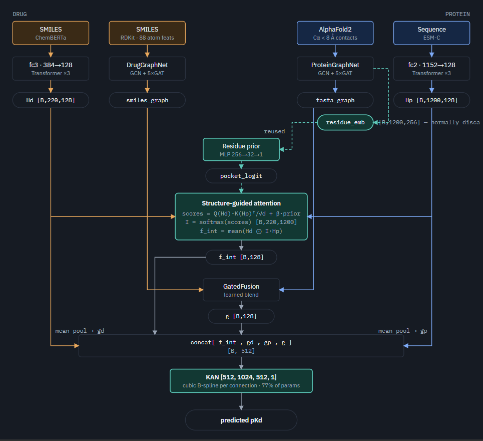

# AF2-PocketCross-DTA

**Drug–target affinity prediction with structure-guided atom↔residue interaction.**

A DTA model built on AlphaFold2 protein structures, evaluated on the harder **cold-protein**
(unseen-target) setting of DAVIS rather than the near-saturated random split.

> Full experimental history, including every failed variant and why it failed, is in
> [EXPERIMENTS.md](EXPERIMENTS.md).

---

## What this project found

The project set out to test whether protein graphs built from **real AlphaFold2 structure**
beat graphs built from **sequence-predicted contacts** for affinity prediction on unseen
targets. Six measured results, in order of how much they constrain the conclusion:

| # | Finding | Evidence |
|---|---------|----------|
| 1 | **Real structure did not help.** AF2-derived contacts score 0.3618; the reference method's ESM-2 *predicted* contacts score 0.314. Substituting real structure made results slightly worse. | this work + [arXiv:2606.04228](https://arxiv.org/abs/2606.04228), which independently measures a **−0.141 information bonus** for AF2 over ESM-2 on binding affinity |
| 2 | **Ranking is at state of the art; absolute accuracy is not.** CI 0.8541 ± 0.0053 vs the best published 0.857 — a gap of 0.0029, and 2nd of 9 overall. MSE is 6th of 9. | results table below |
| 3 | **DAVIS is partly self-contradictory — previously unreported.** 442 target keys, 379 unique sequences. 18.9% of training pairs are mutually contradictory; 11.4% of cold-protein test pairs are unlearnable by construction. | finding 4 below |
| 4 | **The remaining error is missing information, not miscalibration.** An oracle rank-preserving rescale fitted *on the test labels* reaches only 0.3389 — still above 0.314. 94% of error survives any output transform. | finding 2 below |
| 5 | **Capacity is not the bottleneck.** Training MSE 0.0598 against an irreducible floor of 0.0348; a 144× predictor-capacity sweep degrades test accuracy. | finding 5 below |
| 6 | **Every added input feature failed (0 for 3).** RBF edge features, distance-shell pocket features, and AF2 pLDDT confidence all hurt. Only changes that *re-routed existing computation* ever helped. | [EXPERIMENTS.md](EXPERIMENTS.md) |

**Conclusion.** For cold-protein affinity prediction on this benchmark, the sequence already
carries most of the usable signal; the fold adds little on top. Further gains are limited by
**training-protein diversity** (354 proteins), not by architecture, capacity, or output
calibration.

### Related work

AlphaFold-structure protein graphs for DTA were introduced by **3DProtDTA** (RSC Advances, 2023)
and extended with equivariant GNNs by **CASTER-DTA** (2024); the structural grounding here is not
novel in itself. What is contributed is the controlled cold-protein comparison, the error
decomposition, and the benchmark-integrity finding.

---

## What this model does

Most DTA models pool the drug into one vector and the protein into another, then combine them —
discarding the fact that binding is specific **drug atoms** contacting specific **protein residues**.
This model keeps token-level representations and models that interaction directly, weighted by a
residue score derived from the protein's structure-derived contact topology.

**Core components:**

1. **AlphaFold2 contact topology** — protein graphs built from actual Cα coordinates
   (edge if Cα distance < 8Å) rather than sequence-predicted contacts. Note the graph is
   **unweighted**: distances are discarded and none of the six graph layers use edge weights,
   so what reaches the network is contact *topology*, not geometry.
2. **Structure-guided atom↔residue attention** — every drug atom attends over every protein
   residue, with the attention biased by a learned per-residue structural score.
3. **GNN-derived residue prior** — that score comes from `ProteinGraphNet`'s own per-residue
   embeddings (learned by message-passing over the AF2 contact graph) rather than hand-built features.
4. **KAN predictor** — Kolmogorov-Arnold Network, each connection a learned B-spline.

---

## Architecture

<p align="center">
  
</p>

Solid amber and blue trace the drug and protein streams. The dashed teal path is the architecture's
one original move: `ProteinGraphNet`'s per-residue embeddings are normally pooled away, and here they
are kept and turned into a per-residue bias on the atom↔residue attention.

| stage | code | shape out |
|---|---|---|
| Project + contextualise drug tokens | `drug_ln(transformer_encoder(fc3(drug_mat)))` | `[B, 220, 128]` |
| Project + contextualise residues | `target_ln(transformer_encoder2(fc2(prot_mat)))` | `[B, 1200, 128]` |
| Protein contact graph — **two** outputs | `protein_graph_model(protein_graph)` | `[B, 128]` + `[B, 1200, 256]` |
| Score every residue | `pocket(residue_emb)` | `[B, 1200]` |
| Atom↔residue attention, biased by the prior | `interaction(Hd, Hp, …, pocket_logit)` | `[B, 128]` + map `[B, 220, 1200]` |
| Masked, length-normalised sequence means | `gd`, `gp` | `[B, 128]` each |
| Blend the two graph views | `graph_fusion(smiles_graph, fasta_graph)` | `[B, 128]` |
| Predict | `kan(cat([f_int, gd, gp, g]))` | `[B, 1]` |

**Model size:** 13.55 M parameters. **Loss:** plain MSE.

| Setting | Value |
|---------|-------|
| Model file | `code/model_pocketcross_gnnprior.py` |
| Train script | `code/train_pocketcross_gnnprior.py` |
| Sequence encoders | ChemBERTa (384→128), ESM-C (1152→128), 3-layer transformers, 8 heads |
| Graph encoders | GCNConv + 5× GATConv (drug dim 128, protein dim 256) |
| Predictor | KAN [512, 1024, 512, 1], cubic splines, grid 5 |
| Optimizer | Adam, lr 1e-4, no weight decay, flat LR |
| Batch size | 16 · Early stopping: patience 20 on validation MSE |

---

## Results — DAVIS cold-protein (`unseen_prot`)

Test proteins are **entirely held out of training** — the model must generalize to targets it
has never seen. Results are the mean ± std over independent data-split seeds.

| Metric | Seed 41 | Seed 42 | Seed 43 | **Mean ± Std** |
|--------|---------|---------|---------|----------------|
| Test MSE ↓ | 0.3601 | 0.3519 | 0.3735 | **0.3618 ± 0.0109** |
| Test CI ↑ | 0.8590 | 0.8547 | 0.8485 | **0.8541 ± 0.0053** |
| Test r²ₘ ↑ | 0.5460 | 0.4928 | 0.5692 | **0.5360 ± 0.0392** |

_Seed 32 pending._

### Comparison with published methods

Same benchmark and split protocol (KANPM's `cold_split.py`), DAVIS unseen-protein:

| Rank | Model | MSE ↓ | CI ↑ | r²ₘ ↑ |
|------|-------|-------|------|-------|
| 1 | KANPM-DTA | **0.314** | **0.857** | **0.556** |
| 2 | PMMR (2025) | 0.329 | 0.833 | 0.471 |
| 3 | DMFF-DTA (2025) | 0.330 | 0.840 | 0.501 |
| 4 | MgraphDTA (2022) | 0.359 | 0.813 | 0.425 |
| 5 | MSGNN-DTA (2023) | 0.361 | 0.816 | 0.430 |
| **6** | **AF2-PocketCross-DTA (this work)** | **0.3618** | **0.8541** | **0.5360** |
| 7 | FusionDTA (2022) | 0.364 | 0.826 | 0.435 |
| 8 | GRA-DTA (2024) | 0.376 | 0.827 | 0.453 |
| 9 | GraphDTA (2021) | 0.510 | 0.729 | 0.154 |

**Standing:** **2nd of 9 on CI** (gap to 1st is 0.0029, versus 0.0141 to 3rd), **2nd of 9 on r²ₘ**,
6th on MSE.

> ⚠️ **The MSE rank is not meaningful.** At 0.3618 ± 0.0109 this model sits 0.0008 behind
> MSGNN-DTA and 0.0022 ahead of FusionDTA — both margins are an order of magnitude inside its own
> seed spread. Rows 4–7 of that table are a statistical tie, not an ordering.

> ⚠️ **Protocol matters.** Published "DAVIS unseen-protein" numbers are **not** mutually comparable —
> LaPro-DTA (2026) reports baselines at MSE 0.55–0.88 for the same nominal task. The table above is
> valid only because all entries use the same split code. Any comparison outside this protocol is
> meaningless.

---

## Honest findings and limitations

Five results that constrain what can be claimed:

**1. The residue prior does not identify binding sites.**
DAVIS is 100% kinases, whose ATP pockets are anchored by conserved HRD…DFG catalytic motifs.
Tested across 60 kinases with unambiguous motifs, the learned residue score at the ATP site is
**statistically indistinguishable from elsewhere** (52% vs 50% chance, paired t-test p = 0.37,
z = +0.05). The module measurably improves accuracy (+0.020 MSE) and contributes ~22% of attention
steering, but it is **not** learning binding-site location — most plausibly burial/contact density.
No interpretability claim is made. *(`code/validate_pocket.py`)*

**2. The MSE gap is an information deficit, not a calibration artifact.**
Decomposing test error: **99.5% is shape error** (wrong values on individual pairs), only 0.5% is
systematic offset. Post-hoc linear calibration fitted on validation recovers just −0.0075 MSE.
Every output-side transform, measured on seed 41:

| transform | test MSE | CI | r²ₘ |
|---|---|---|---|
| as-is | 0.3601 | 0.8590 | 0.5460 |
| clamp at the pKd = 5.0 floor | 0.3593 *(−0.0008)* | 0.8585 | 0.5490 |
| variance-matched (expand to true range) | **0.3968** ❌ | 0.8590 | 0.4605 |
| *oracle* linear — fitted **on test labels** | 0.3525 | 0.8590 | 0.6034 |
| ***oracle* monotone — best possible** | **0.3389** | 0.8609 | 0.6186 |
| honest monotone (fit half, apply to other) | 0.3564 *(−0.0037)* | — | — |

The best achievable by **any** rank-preserving transform — cheating by fitting on the answers — is
**0.3389**, still above KANPM's 0.314. **94% of the error survives it.** Expanding the range
actively hurts (+0.037): the compression is correct shrinkage under uncertainty, not a defect.
Error is concentrated where it matters — the 30.3% of pairs that are real measurements (not the
censored floor) carry **76.5%** of it, with underprediction growing to **−1.104** for the
strongest binders. *(`code/analysis/oracle_bound.py`, `code/calib_check.py`)*

**3. Validation systematically overstates performance.**
Across all **7 completed cold-protein runs** the valid→test gap is positive **7/7 times**, mean
**+0.065** (range +0.032 to +0.132). Two causes are separable. **Selection bias** — the single
best-validation epoch sits **+0.014 to +0.046** below the mean of the epochs around it (mean
+0.025), which is winner's curse rather than real degradation. **Label variance** — valid and
test are two different 44-protein samples, and MSE scales with label spread: on seed 41 the test
labels are more spread than validation (+0.176 variance), on seed 42 less (−0.095). The remainder
is intrinsic difficulty difference between the two samples. **Validation ranking does not reliably
predict test ranking** — two same-split inversions are on record, and a variant leading on
validation still lost on test. *(`code/analysis/valid_test_gap.py`)*

**4. The DAVIS benchmark is partly self-contradictory.**
DAVIS has **442 target keys but only 379 unique sequences** — the mutations were never applied to
the sequence strings, so `BRAF` and `BRAF(V600E)` carry identical sequences, and 62 of 63 colliding
key-pairs also share a byte-identical contact map. The model therefore receives **identical input**
for pairs with different labels. Measured consequences:

| | |
|---|---|
| target keys / unique sequences | **442 / 379** — 81 keys across 18 collision groups |
| colliding keys sharing an identical AF2 contact map | **62 of 63** |
| contradictory **training** pairs | **4,556 / 24,072 = 18.9%** |
| irreducible train-MSE floor this imposes | **0.0348** |
| **test** pairs with an identical (sequence, drug) in train | **340 / 2,992 = 11.4%** |
| best possible MSE on those | 0.2259 |
| their contribution to test MSE | **0.0257 of 0.3601 (~7%)** — unfixable by any architecture |

This affects every published result on this benchmark, and partly explains why the field
plateaus at 0.31–0.36. *(`code/analysis/benchmark_integrity.py`)*

**5. Adding input features has failed every time (0 for 3).**
RBF edge features, 8-dim distance-shell pocket features, and AlphaFold2 pLDDT confidence as a protein
node channel all hurt. pLDDT was the strongest test — genuinely orthogonal information at a cost of
256 parameters — and still lost by +0.027 MSE. The only changes that ever helped **re-routed
computation the model already performed** rather than feeding it new inputs. Full write-ups in
[EXPERIMENTS.md](EXPERIMENTS.md).

**6. Capacity is not the bottleneck — the representation is.**
The selected checkpoint fits its training data to **0.0788** against an irreducible floor of
**0.0348** (the training log reaches 0.0598 by the final epoch, measured mid-epoch with dropout
active on a later, more-overfit model). So the predictor is not capacity-starved. Sweeping head
capacity on the frozen 512-d representation, seed 41:

| head | params | valid | test MSE |
|---|---|---|---|
| **KAN [512,1024,512,1]** | 10,490,880 | — | **0.3601** |
| ridge (linear) | 513 | 0.3474 | 0.4435 |
| MLP 512-256-1 | 131,585 | 0.2520 | **0.3758** ← best MLP |
| MLP 512-1024-512-1 | 1,050,625 | 0.2503 | 0.3796 |
| MLP 512-4096-2048-1 | 10,493,953 | 0.2561 | 0.3931 ← KAN-matched |
| MLP 512-4096-4096-1 | 18,886,657 | 0.2539 | 0.3886 ← **144×**, worse |

Validation barely moves across the whole 144× range (0.2463–0.2561) while test degrades — textbook
over-capacity. No MLP reaches the KAN at any width, so the KAN's advantage is the spline basis, not
size. The head contributes (ridge 0.4435 → KAN 0.3601) but is deep in diminishing returns while the
representation caps the result. *(`code/analysis/capacity_probe.py`)*

### Reproducing each finding

Every claim above is backed by a script. Commands are run from the repository root.

| # | Finding | Reproduce with | Needs GPU |
|---|---------|----------------|-----------|
| 1 | Residue prior does not identify binding sites | `python code/validate_pocket.py` | yes |
| 2 | Information deficit — calibration recovers little | `python code/calib_check.py` | yes |
| 2 | **Oracle bound 0.3389** | `python code/analysis/oracle_bound.py` | yes |
| 3 | Validation overstates performance | `python code/analysis/valid_test_gap.py` | **no** |
| 4 | **DAVIS is partly self-contradictory** | `python code/analysis/benchmark_integrity.py` | **no** |
| 5 | Added input features failed (0 for 3) | see [EXPERIMENTS.md](EXPERIMENTS.md) — each run logged in full | — |
| 6 | Capacity is not the bottleneck | `python code/analysis/capacity_probe.py` | yes |

Analysis scripts are read-only and regenerate their data split **in memory**, so they never
touch `datasets/` and are safe to run while a training job is in progress. The CPU-only ones
can be run at any time; the GPU ones will contend with training for the card.

**Other limitations:** 3 seeds only (seed 32 pending); only the cold-protein split evaluated (unseen-drug and
unseen-pair untested); trained on 442 proteins, which is the binding constraint on generalization.

---

## Data and preprocessing

| Source | Model | Output |
|--------|-------|--------|
| ChemBERTa (`DeepChem/ChemBERTa-77M-MTR`) | Drug SMILES → token embeddings | 384-dim |
| ESM-C (`esmc_600m`) | Protein sequence → residue embeddings | 1152-dim |
| AlphaFold2 (EBI) + UniProt | Protein → real 3D Cα contact map | L × L |
| RDKit | SMILES → molecular graph | 88 atom features |

**DAVIS AlphaFold2 coverage:** 364 proteins direct · 72 wildtype-for-mutant (point mutations do
not change the fold) · 6 backbone fallback (non-human, no AF2 entry). All 442 proteins included.

**Split sizes:**

| Split | Train | Valid | Test |
|-------|-------|-------|------|
| Warm | 24,044 | 3,006 | 3,006 |
| **Unseen Protein** | **24,072** | **2,992** | **2,992** |
| Unseen Drug | 23,868 | 3,094 | 3,094 |
| Unseen Pair | 19,116 | 308 | 308 |

<details>
<summary>Drug graph node features (88-dim)</summary>

| Feature | Dim |
|---------|-----|
| Atom symbol (one-hot) | 44 |
| Degree (one-hot) | 11 |
| Total H on heavy atom | 11 |
| Explicit / implicit hydrogens | 12 |
| Hybridization type | 3 |
| Donor / acceptor | 2 |
| Formal charge, explicit valence, ring count, radical electrons, aromatic | 5 |
| **Total** | **88** |

</details>

---

## Setup

```bash
# pinned to the environment the reported results came from
pip install torch==2.9.1 --index-url https://download.pytorch.org/whl/cu128
pip install -r requirements.txt
```

> `requirements.txt` documents a known conflict: ESM-C (`esm`) and ESM-2 (`fair-esm`) both
> import as `esm` and cannot coexist. Only ESM-C is needed to reproduce this work.

```bash
# 1. Generate pretrained embeddings
python pretrained/chemberta_pretraiend.py
python pretrained/esmC_pretraiend.py

# 2. Download AlphaFold2 structures and build contact maps
python pretrained/alphafold2_preprocess.py --dataset davis

# 3. Generate splits  (set SEED in cold_split.py to match SPLIT_SEED in the train script)
python code/cold_split.py --dataset davis

# 4. Train  (set running_set='unseen_prot' in hyperparameter.py)
python code/train_pocketcross_gnnprior.py
```

Training resumes automatically from a checkpoint if one exists. Results are written to
`log/Test-{dataset}-{split}-split{SEED}_new_gnnprior.csv` once early stopping triggers naturally.

---

## References

1. Liu et al. (2024) *KAN: Kolmogorov-Arnold Networks* — arXiv:2404.19756
2. Jumper et al. (2021) *AlphaFold2* — Nature 596, 583–589
3. Ahmad et al. (2022) *ChemBERTa-2* — arXiv:2209.01712
4. ESM Team (2024) *ESM-C* — Evolutionary Scale
5. Lin et al. (2023) *ESM-2* — Science 379(6637)
6. KANPM-DTA (2026) — Briefings in Bioinformatics, bbag112
7. 3DProtDTA (2023) — RSC Advances, D3RA00281K
